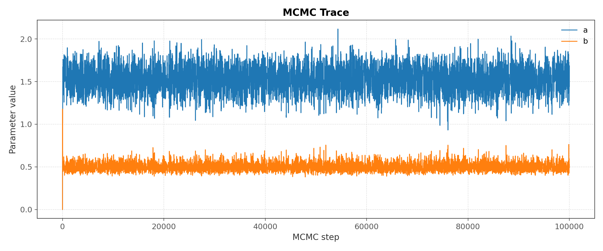
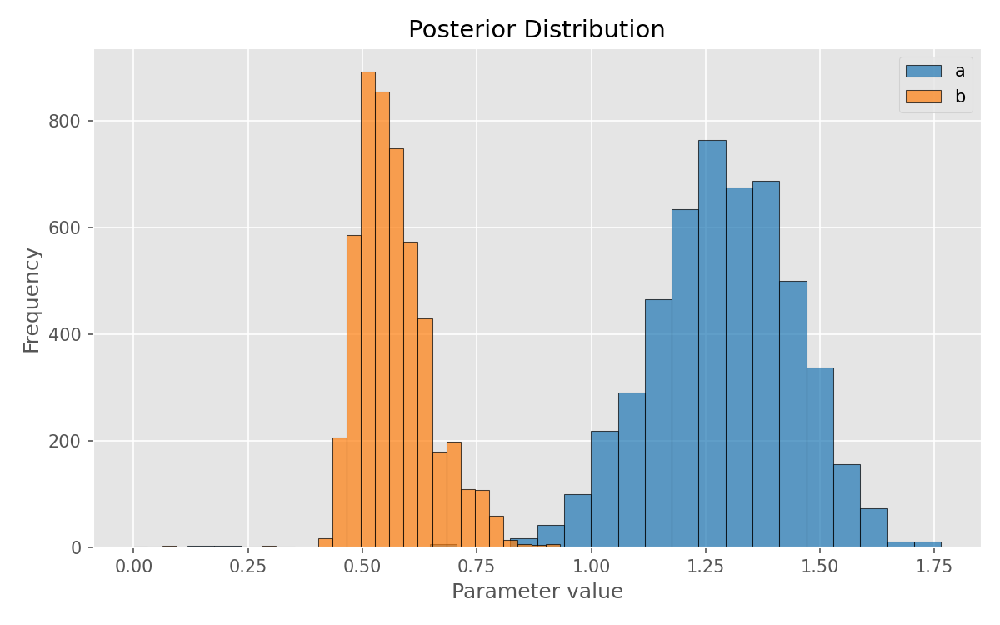
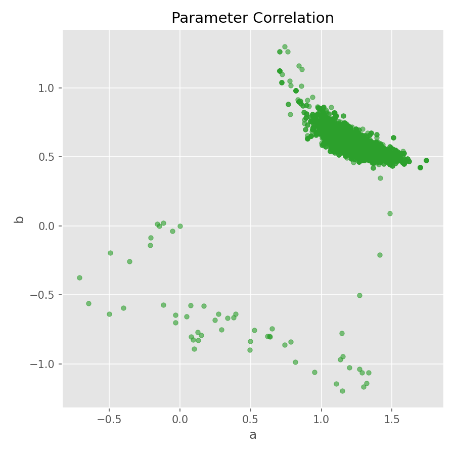

# ParamInsight: MCMC Parameter Inference Tool (2D)

ParamInsight is a lightweight Python tool for performing **Bayesian parameter inference** using **MCMC (Metropolis-Hastings)** on custom 2D models.  
It supports user-defined models and observational data, generating **chains, statistical analysis, and visualizations**.  
This project demonstrates capabilities in **data analysis, statistical inference, and MCMC implementation from scratch**.

---

## Logarithmic Example

**Model:** F(x) = a * log(b * x)

**Observational Data (Transposed):**

| x     | 1.0   | 1.5   | 2.0   | 2.5   | 3.0   | 3.5   | 4.0   | 4.5   | 5.0   | ... |
|-------|-------|-------|-------|-------|-------|-------|-------|-------|-------|-----|
| y     | 0.2   | 0.5   | 0.8   | 1.1   | 1.3   | 1.5   | 1.7   | 1.9   | 2.1   | ... |
| dy    | 0.30  | 0.28  | 0.32  | 0.31  | 0.29  | 0.30  | 0.27  | 0.32  | 0.31  | ... |

**Estimated Parameters:**

| Parameter | Mean ± Std  | True Value | Absolute Error | % Error |
|-----------|------------|------------|----------------|---------|
| a         | 1.51 ± 0.05 | 1.50       | 0.01           | 0.67%   |
| b         | 0.48 ± 0.03 | 0.50       | 0.02           | 4.00%   |

**Plots:**

Trace plot | Histogram | Scatter
:---------:|:---------:|:------:
 |  | 

---

## Features

- Supports **custom 2D models**: linear, logarithmic, quadratic, inverse, etc.
- Implements **Metropolis-Hastings MCMC** from scratch.
- Generates:
  - MCMC chains (`.npz`)
  - Trace plots
  - Histograms
  - Scatter plots
  - Final parameter analysis
- Observational data saved in `.txt` files.
- Fully reproducible using **fixed random seed**.

---

## Usage

```bash
python3 main.py
```

All results (data, plots, analysis) are stored in the `data/`, `plots/`, and `results/` directories respectively.

---

## Purpose

ParamInsight was developed to **assist the scientific and data analysis community** in performing parameter inference with **transparent, fully customizable models**.  
It demonstrates the ability to **implement statistical methods from scratch**, generate meaningful insights, and visualize results cleanly.

