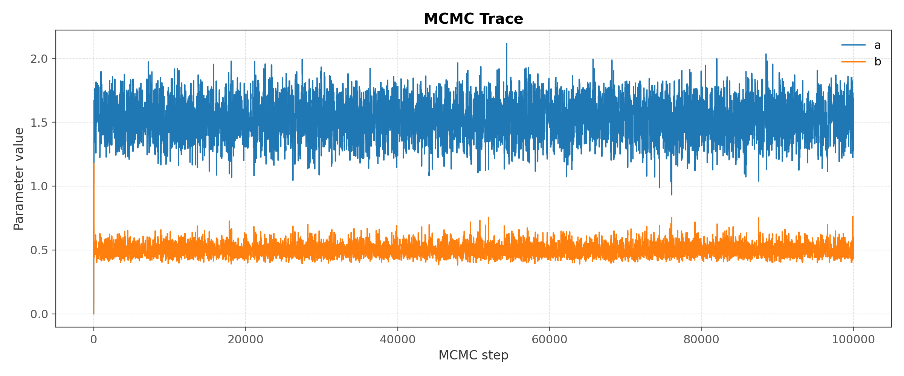
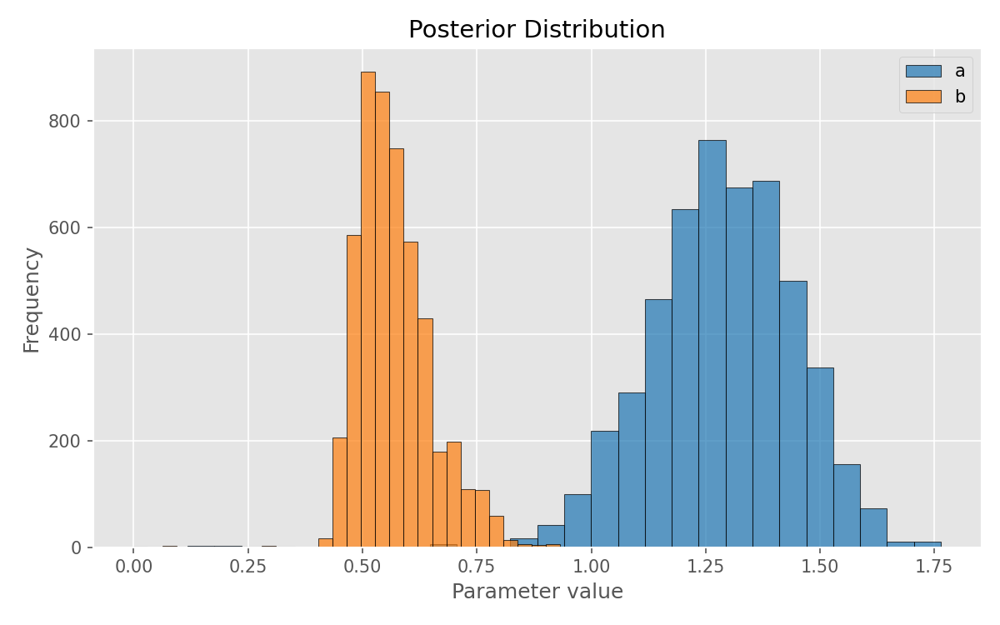
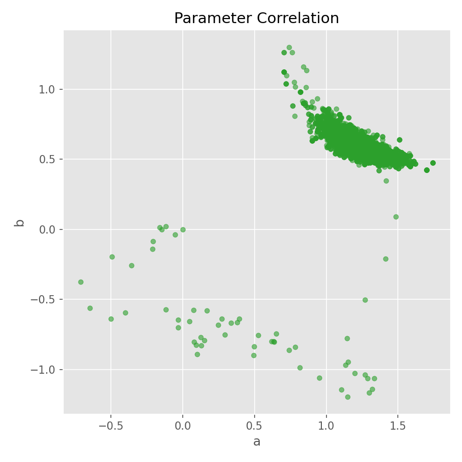

# 🚀 ParamInsight — MCMC-Based Bayesian Parameter Inference (2D)

ParamInsight is a Python tool for Bayesian parameter inference using a custom Metropolis–Hastings MCMC implementation for two-parameter models.

The framework provides a complete statistical workflow for parameter estimation, posterior exploration, and uncertainty quantification with reproducible outputs.

**Author:** Kevin Mota da Costa
**Portfolio:** [https://costakevinn.github.io](https://costakevinn.github.io)
**LinkedIn:** [https://linkedin.com/in/SEUUSER](https://linkedin.com/in/SEUUSER)

---

## 🎯 Project Purpose

ParamInsight was developed to explore likelihood-based inference and posterior sampling under realistic noise conditions.

The system is designed to:

* Estimate model parameters under uncertainty
* Explore correlated parameter spaces
* Generate posterior diagnostics
* Quantify uncertainty beyond point estimates

This reflects a probabilistic-first approach to modeling and statistical analysis.

---

## 🧠 Statistical Formulation

Given observed data (x_i, y_i) with measurement uncertainty dy_i and a parametric model F(x; a, b):

The Gaussian log-likelihood is defined as:

log L(a, b) = -1/2 Σ [ (y_i − F(x_i; a, b))² / dy_i² ]

Maximizing the likelihood corresponds to minimizing the chi-square statistic, a standard method in statistical inference.

---

## 🔄 MCMC Sampling Strategy

ParamInsight uses a custom Metropolis–Hastings sampler with momentum-based proposal memory:

a' = a_(n-1) + 0.5 * (a_(n-1) − a_(n-2)) + Normal(0, σ)
b' = b_(n-1) + 0.5 * (b_(n-1) − b_(n-2)) + Normal(0, σ)

Acceptance probability:

α = min(1, exp(logL_new − logL_old))

### Design Rationale

* Memory-based proposal improves exploration of correlated parameter spaces
* Reduces random-walk inefficiency
* Enhances convergence behavior in 2D inference problems

This approach balances stability and sampling efficiency.

---

## 📊 Example: Logarithmic Model

Model:
F(x) = a * log(b * x)

True parameters:
a = 1.5
b = 0.5

Sample estimation results:

| Parameter | Mean ± Std  | True | % Error |
| --------- | ----------- | ---- | ------- |
| a         | 1.51 ± 0.05 | 1.50 | 0.67%   |
| b         | 0.48 ± 0.03 | 0.50 | 4.00%   |

---

## 📈 Posterior Diagnostics

| Trace                            | Histogram                            | Scatter                            |
| -------------------------------- | ------------------------------------ | ---------------------------------- |
|  |  |  |

Diagnostics include:

* Trace plots (chain mixing)
* Posterior histograms
* Parameter correlation visualization

---

## 🔬 Capabilities Demonstrated

* Custom MCMC implementation
* Likelihood-based inference
* Posterior uncertainty estimation
* Correlated parameter exploration
* Convergence diagnostics
* Reproducible statistical workflow

---

## 🛠 Features

* Custom 2-parameter models:

  * Linear
  * Logarithmic
  * Quadratic
  * Inverse

* Gaussian noise generation (Box–Muller)

* Heteroscedastic uncertainty handling

* Automatic output generation:

  * MCMC chains (.npz)
  * Trace plots
  * Posterior histograms
  * Correlation plots

---

## ▶ Usage

```bash
python3 main.py
```

Outputs are saved to:

* `data/` → Observations and MCMC chains
* `plots/` → Posterior diagnostics
* `results/` → Parameter summaries

---

## 🛠 Tech Stack

### Programming

Python

### Scientific Computing

* NumPy
* SciPy

### Statistical Methods

* Bayesian inference
* Metropolis–Hastings MCMC
* Gaussian likelihood modeling

### Visualization

* Matplotlib

---

## 🌐 Portfolio

This project is part of my Machine Learning portfolio:
👉 [https://costakevinn.github.io](https://costakevinn.github.io)

---

## License

MIT License — see `LICENSE` for details.
